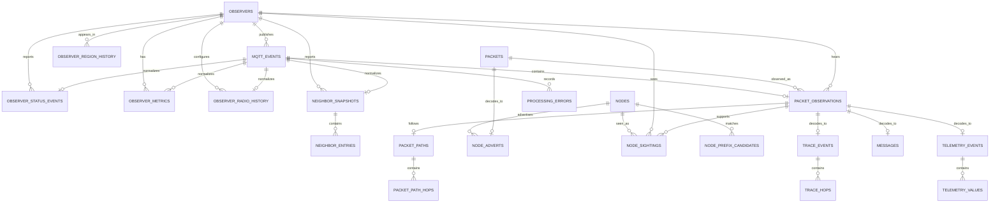

# PostgreSQL database

The broker uses the pre-provisioned PostgreSQL `meshcore` database. Historical coverage is retention-bounded by `storage.retention_days`.

## Schema lifecycle

`postgres/initdb/02-meshcore-schema.sql.inc` is the static clean-install schema asset. `postgres/initdb/01-meshcore-bootstrap.sql` creates the roles and `meshcore` database, requires PostGIS and TimescaleDB in that database, then runs the asset as the no-login `meshcore_owner` role. This creates every private/public table, projection function, trigger, index, and metadata marker before the broker starts.

`meshcore_broker` has only schema usage, DML, sequence usage, and projection-function execution grants. Production startup validates:

- the expected schema ID and version;
- every required private and public table;
- a bounded readiness query.

Production never creates, repairs, drops, or migrates database objects. An incompatible database must be reprovisioned explicitly. The test database factory may create clean test schemas from the current DDL.

## Data model

The main identities are deliberately separate:

- `mqtt_events` is an exact MQTT receipt. `payload_blob` is authoritative.
- `observers` identifies the MQTT upload device from the topic.
- `packets` identifies MeshCore bytes by `SHA-256(raw_packet_blob)`.
- `logical_packets` identifies one logical MeshCore transmission across FLOOD paths and RF observations. Its id is a per-type canonical payload hash (signed advert key/timestamp/signature, message source/destination/channel/ciphertext, trace tag/hops/SNR, response telemetry) over decoded payload bytes; only undecodable packets fall back to the raw packet hash, so route/path bytes never affect it. Full hash precision is preserved for message, trace, and response identities.
- `packet_observations` records that one observer reported one packet receipt.
- `nodes` identifies a MeshCore node learned from decoded protocol evidence.

Therefore one packet heard by three observers is one `packets` row, one `logical_packets` row, and three `packet_observations` rows, and the same transmission flooded through several paths is several `packets` rows sharing one `logical_packets` row. An observer public key is never assumed to be the packet source node.

All receipt and processing times ending in `_ms` are UTC Unix epoch milliseconds. MeshCore advert timestamps retain the protocol's integer representation.

## Tables and indexes

| Group         | Tables                                                                                                         | Purpose                                                                                           |
| ------------- | -------------------------------------------------------------------------------------------------------------- | ------------------------------------------------------------------------------------------------- |
| Raw ingest    | `mqtt_events`, `processing_errors`                                                                             | Exact payloads, MQTT metadata, parser/processor state, durable errors and replay metadata         |
| Observers     | `observers`, `observer_region_history`, `observer_status_events`, `observer_metrics`, `observer_radio_history` | Observer identity, regional presence, append-only status, generic metrics and radio history       |
| Neighbors     | `neighbor_snapshots`, `neighbor_entries`                                                                       | Append-oriented snapshots, normalized entries, scopes and retained-replay classification          |
| Packets       | `packets`, `logical_packets`, `packet_observations`, `packet_paths`, `packet_path_hops`                        | Byte identity, route-independent logical identity, every RF observation and decoded routing paths |
| Nodes         | `nodes`, `node_adverts`, `node_sightings`, `node_prefix_candidates`                                            | Current trusted node state plus advert/sighting history and ambiguity-aware prefix evidence       |
| Protocol data | `trace_events`, `trace_hops`, `messages`, `telemetry_events`, `telemetry_values`                               | Normalized TRACE, message and telemetry records while retaining decoded JSON                      |

The pre-existing Aedes persistence, broker state, node API, target-forwarding, and MeshCore.io tables remain part of the same canonical clean-install schema.

`messages` stores the normalized message record per packet observation: type, channel hash/index, sender/destination prefix and resolved node, `encrypted`, plaintext `text` when available, raw payload bytes (`payload_blob`), signature state, reported/received times, and — when channel decryption is configured — `channel_name`, `decrypted_sender`, and `decrypted_flags`. Channel keys themselves are never stored in the database.

High-volume history indexes lead with bounded query and cleanup keys: `received_at_ms`, `(observer_id, received_at_ms, id)`, `(packet_id, received_at_ms, id)`, processing state/version, or packet identity. The event-stream and decryption-related indexes (`telemetry_events_received`, `node_adverts_observed`, `observer_status_events_received`) lead with their window timestamp. Reprocessing filters use time ranges, bounded limits, and `(received_at_ms, id)` cursors rather than large offsets. Natural identifiers are unique; relational joins use integer primary keys and bound parameters.

Owned children use `ON DELETE CASCADE`, including neighbor entries, packet paths/hops, trace hops, telemetry values, and event-derived observations. Node/observer references use stricter cascade or `SET NULL` behavior according to whether the child represents owned history or an independently useful decoded relation.

## Retention

At every run, retention computes:

```text
cutoff_ms = current UTC time - current config storage.retention_days
```

Only `mqtt_events.received_at_ms <= cutoff_ms` is authoritative. Reported, packet, advert, decoded, and reprocessed timestamps never extend retention. Events whose processing is in flight (`processing_status = 'processing'`) are never expired, so a claimed event always completes its normalization transaction. Deletes commit in `cleanup_batch_size` batches (bounded 1..10,000). Cascades remove event-owned history; follow-up cleanup removes packets with no observations, logical packets with no packets, nodes with no supporting history, and observers with no retained data. Follow-up orphan cleanup runs only after at least one event batch was deleted and commits in smaller batches (max 200) so each transaction stays short. A batch that is interrupted by the query timeout is logged and the run resumes from that point on the next interval instead of aborting the whole run. Observer region aggregates are maintained incrementally per processed event; retention adjusts them from the deleted batch and recomputes boundaries only when the expired rows include the current minimum or maximum. Remaining packet, logical-packet, prefix, and latest trusted node state is recomputed from retained supporting rows. Indexes cover the time-window queries (`received_at_ms`-leading indexes on `packet_observations`, `node_sightings`, `mqtt_events`), region scoping, and every cascade-path foreign key child column.

Changing `retention_days` and restarting immediately changes future cleanup decisions. No per-row expiry permanently captures an earlier policy.

## Entity relationships



## Backup and reset expectations

Use a PostgreSQL-aware backup procedure. Back up before deploying a release with a changed schema: there is no migration or runtime repair path, so an incompatible schema must be explicitly reprovisioned.
