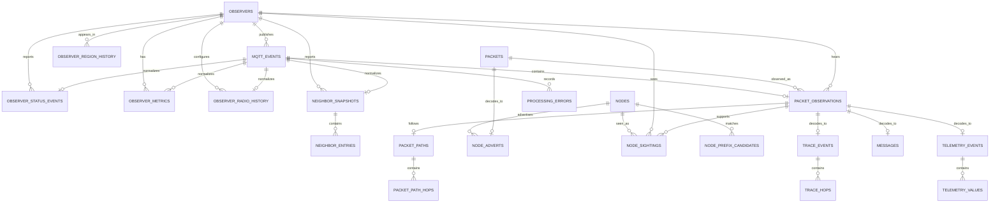

# Historical database

The embedded file-backed Turso/libSQL database remains fixed at:

```text
/data/meshcore-mqtt-broker/meshcore-mqtt-broker.db
```

It is a retention-bounded operational cache, not permanent archival storage. Its historical coverage starts at the most recent schema reset and ends at the current `storage.retention_days` cutoff.

## Schema lifecycle

`src/database.ts` is the single canonical schema definition. `CURRENT_SCHEMA_VERSION` is `1` for the historical event schema. There are no migration files, migration runner, incremental upgrades, `ALTER TABLE` repair steps, or old-schema imports.

Startup enables foreign keys and validates:

- schema ID and version;
- the fingerprint of every application table, index, constraint, and foreign-key declaration;
- every required table and column;
- active foreign-key enforcement and `PRAGMA foreign_key_check`;
- a bounded readiness query.

An empty database receives the complete current schema. An incompatible initialized database is closed, deleted together with known SQLite/libSQL sidecars, recreated, validated, and clearly logged. Healthchecks and CLI reads validate without resetting. No automatic backup is created.

## Data model

The main identities are deliberately separate:

- `mqtt_events` is an exact MQTT receipt. `payload_blob` is authoritative.
- `observers` identifies the MQTT upload device from the topic.
- `packets` identifies MeshCore bytes by `SHA-256(raw_packet_blob)`.
- `logical_packets` identifies one logical MeshCore transmission across FLOOD paths and RF observations. Its id is a per-type canonical payload hash (signed advert key/timestamp/signature, message source/destination/channel/ciphertext, trace tag/hops/SNR, response telemetry) over decoded payload bytes; only undecodable packets fall back to the raw packet hash, so route/path bytes never affect it. Full hash precision is preserved for message, trace, and response identities.
- `packet_observations` records that one observer reported one packet receipt.
- `nodes` identifies a MeshCore node learned from decoded protocol evidence.

Therefore one packet heard by three observers is one `packets` row, one `logical_packets` row, and three `packet_observations` rows, and the same transmission flooded through several paths is several `packets` rows sharing one `logical_packets` row. An observer public key is never assumed to be the packet source node.

All receipt and processing times ending in `_ms` are UTC Unix epoch milliseconds. MeshCore advert timestamps retain the protocol's integer representation.

## Tables and indexes

| Group          | Tables                                                                                                         | Purpose                                                                                           |
| -------------- | -------------------------------------------------------------------------------------------------------------- | ------------------------------------------------------------------------------------------------- |
| Raw ingest     | `mqtt_events`, `processing_errors`                                                                             | Exact payloads, MQTT metadata, parser/processor state, durable errors and replay metadata         |
| Cursor signing | `cursor_signing_secret`                                                                                        | Singleton HMAC secret for stateless tamper-proof public query cursors (shared by all instances)   |
| Observers      | `observers`, `observer_region_history`, `observer_status_events`, `observer_metrics`, `observer_radio_history` | Observer identity, regional presence, append-only status, generic metrics and radio history       |
| Neighbors      | `neighbor_snapshots`, `neighbor_entries`                                                                       | Append-oriented snapshots, normalized entries, scopes and retained-replay classification          |
| Packets        | `packets`, `logical_packets`, `packet_observations`, `packet_paths`, `packet_path_hops`                        | Byte identity, route-independent logical identity, every RF observation and decoded routing paths |
| Nodes          | `nodes`, `node_adverts`, `node_sightings`, `node_prefix_candidates`                                            | Current trusted node state plus advert/sighting history and ambiguity-aware prefix evidence       |
| Protocol data  | `trace_events`, `trace_hops`, `messages`, `telemetry_events`, `telemetry_values`                               | Normalized TRACE, message and telemetry records while retaining decoded JSON                      |

The pre-existing Aedes persistence, broker state, node API, target-forwarding, and MeshCore.io tables remain part of the same canonical clean-install schema.

`messages` stores the normalized message record per packet observation: type, channel hash/index, sender/destination prefix and resolved node, `encrypted`, plaintext `text` when available, raw payload bytes (`payload_blob`), signature state, reported/received times, and — when channel decryption is configured — `channel_name`, `decrypted_sender`, and `decrypted_flags`. Channel keys themselves are never stored in the database.

High-volume history indexes lead with bounded query and cleanup keys: `received_at_ms`, `(observer_id, received_at_ms, id)`, `(packet_id, received_at_ms, id)`, processing state/version, or packet identity. The event-stream and decryption-related indexes (`telemetry_events_received`, `node_adverts_observed`, `observer_status_events_received`) lead with their window timestamp. Reprocessing filters use time ranges, bounded limits, and `(received_at_ms, id)` cursors rather than large offsets. Natural identifiers are unique; relational joins use integer primary keys and bound parameters.

Owned children use `ON DELETE CASCADE`, including neighbor entries, packet paths/hops, trace hops, telemetry values, and event-derived observations. Node/observer references use stricter cascade or `SET NULL` behavior according to whether the child represents owned history or an independently useful decoded relation.

## Retention

At every run, retention computes:

```text
cutoff_ms = current UTC time - current config storage.retention_days
```

Only `mqtt_events.received_at_ms <= cutoff_ms` is authoritative. Reported, packet, advert, decoded, and reprocessed timestamps never extend retention. Events whose processing is in flight (`processing_status = 'processing'`) are never expired, so a claimed event always completes its normalization transaction. Deletes commit in `cleanup_batch_size` batches (bounded 1..10,000). Cascades remove event-owned history; follow-up cleanup removes packets with no observations, logical packets with no packets, nodes with no supporting history, and observers with no retained data. Observer region aggregates are maintained incrementally per processed event; retention adjusts them from the deleted batch and recomputes boundaries only when the expired rows include the current minimum or maximum. Remaining packet, logical-packet, prefix, and latest trusted node state is recomputed from retained supporting rows. Indexes cover the time-window queries (`received_at_ms`-leading indexes on `packet_observations`, `node_sightings`, `mqtt_events`), region scoping, and every cascade-path foreign key child column.

Changing `retention_days` and restarting immediately changes future cleanup decisions. No per-row expiry permanently captures an earlier policy.

## Entity relationships



## Backup and reset expectations

Stop the container and copy the complete mounted directory for a consistent backup. An online copy requires a database-aware procedure. Back up before starting a release with a changed schema: the next initialized broker startup intentionally deletes incompatible history instead of migrating it.
