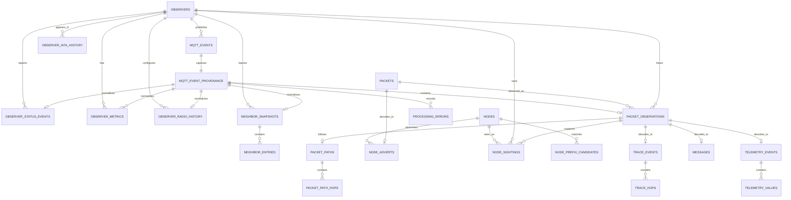

# PostgreSQL database

The broker uses the pre-provisioned PostgreSQL `meshcore` database. Raw payload and normalized-history lifetimes are configured independently with `storage.raw_retention_days` and `storage.normalized_retention_days`.

## Schema lifecycle

`postgres/initdb/02-meshcore-schema.sql.inc` is the static clean-install schema asset. `postgres/initdb/01-meshcore-bootstrap.sql` creates the roles and `meshcore` database, requires PostGIS and TimescaleDB in that database, then runs the asset as the no-login `meshcore_owner` role. This creates every private/public table, projection function, trigger, index, and metadata marker before the broker starts.

`meshcore_broker` has only schema usage, DML, sequence usage, and projection-function execution grants. Production startup validates:

- the expected schema ID and version;
- every required private and public table;
- a bounded readiness query.

Production favors MQTT availability over incompatible history. A current valid database opens unchanged. Versions 9, 10, and 11 use the known migration chain to v12 within the configured overall deadline. Migration remains availability-first: a reachable known migration that fails or times out falls back to one canonical reprovision, while unsupported, future, unknown, incomplete, and fingerprint-mismatched layouts may also be recreated once and validated. Connectivity, authentication, permission, disk, and other infrastructure failures are propagated without reset. Failed validation after fresh provisioning is fatal and cannot trigger a second reset in the same process.

Both metadata markers persist the same `database_created_at timestamptz`. Fresh provisioning and full recreation create a new PostgreSQL timestamp. Normal reopen does not update it. For legacy v9/v10 migration, it is initialized when creation metadata is introduced because the original historical creation time cannot be proven. Relative age is derived for status responses and is never persisted.

## Data model

The main identities are deliberately separate:

- `mqtt_events` is an exact MQTT receipt. `payload_blob` is authoritative.
- `observers` identifies the MQTT upload device from the topic.
- `packets` identifies MeshCore bytes by `SHA-256(raw_packet_blob)`.
- `logical_packets` identifies one logical MeshCore transmission across FLOOD paths and RF observations. Its id is a per-type canonical payload hash (signed advert key/timestamp/signature, message source/destination/channel/ciphertext, trace tag/hops, response telemetry) over decoded payload bytes; only undecodable packets fall back to the raw packet hash, so route/path bytes never affect it. Trace SNR values are observation metadata and are excluded from the trace identity: every observation of one trace transmission shares one logical id regardless of reported SNR. Full hash precision is preserved for message, trace, and response identities.
- `packet_observations` records that one observer reported one packet receipt.
- `nodes` identifies a MeshCore node learned from decoded protocol evidence.

Therefore one packet heard by three observers is one `packets` row, one `logical_packets` row, and three `packet_observations` rows, and the same transmission flooded through several paths is several `packets` rows sharing one `logical_packets` row. An observer public key is never assumed to be the packet source node.

All receipt and processing times ending in `_ms` are UTC Unix epoch milliseconds. MeshCore advert timestamps retain the protocol's integer representation.

## Public reader contract

`meshcore_public` is the stable direct-reader model for an external HTTP or MCP process. `meshcore_http` has only `SELECT` and schema usage there; it cannot access `meshcore_private`, mutate data, or execute broker functions. Its connection limit is 5, and its sessions use a read-only default transaction, a 5-second statement timeout, a 1-second lock timeout, and a 10-second idle-in-transaction timeout.

`schema_metadata` exposes the schema ID, version, semantic hash, and database-generation timestamp. Ordinary performance indexes are excluded from fingerprint-v2. Readers must use `received_at_ms` plus the stable primary key for keyset pagination; `reported_at_ms` is device-provided context, not an ingestion ordering key.

`neighbor_snapshot_scopes` links an observer's scope claims to each snapshot. `neighbor_entry_scopes` links a reported neighbor node to each scope observed for it. Join the latter through `neighbor_entries` to answer which nodes have been reported in a scope, preserving the reporting observer, snapshot time, RF metadata, and neighbor status. `nodes.location` holds each node's latest verified advert location and `node_adverts.location` preserves historic verified advert locations as PostGIS geography points.

IATA coverage is stored at hearing granularity because one packet can cross geographic MQTT ingress boundaries. `packet_observations.iata` records the observer's topic IATA for every hearing, `node_sightings.iata` records where each node was sighted, and `neighbor_snapshots.iata`, `observer_status.iata`, and `observers.iata` record the reporting observer's IATA. `messages`, `traces`, `telemetry`, and `packet_paths` join through `packet_observation_id` to the hearing IATA. IATA-leading `(iata, received_at_ms DESC, id DESC)` indexes on `packet_observations` and `node_sightings` support bounded IATA filters. Every normalized IATA column has a database check requiring exactly three uppercase letters:

```sql
SELECT DISTINCT packet_sha256 FROM meshcore_public.packet_observations WHERE iata = 'JKG';
SELECT DISTINCT node_public_key FROM meshcore_public.node_sightings WHERE iata = 'JKG';
SELECT t.* FROM meshcore_public.traces t
JOIN meshcore_public.packet_observations po ON po.id = t.packet_observation_id
WHERE po.iata = 'JKG';
```

`node_prefix_candidates` is projected publicly so a read-only HTTP/MCP process can reconstruct prefix alternatives in retrospect: each row exposes `prefix_hex`, `prefix_length_bytes`, `node_public_key`, `first_seen_at_ms`, `last_seen_at_ms`, `evidence_count`, and `confidence`. When a `packet_path_hops` or `trace_hops` row has `resolution_status = 'ambiguous'`, join its `prefix_hex` and `prefix_length_bytes` to this table to list every possible node and its confidence. The candidates reflect the accumulated evidence current at read time, not a frozen snapshot of the hop at ingestion time.

## Tables and indexes

| Group         | Tables                                                                                                         | Purpose                                                                                                                          |
| ------------- | -------------------------------------------------------------------------------------------------------------- | -------------------------------------------------------------------------------------------------------------------------------- |
| Raw ingest    | `mqtt_events`, `processing_errors`                                                                             | Exact payloads, MQTT metadata, parser/processor state, durable errors and replay metadata                                        |
| Observers     | `observers`, `observer_iata_history`, `observer_status_events`, `observer_metrics`, `observer_radio_history`   | Observer identity, IATA presence, append-only status, generic metrics and radio history; private `observer_metrics` is Timescale |
| Neighbors     | `neighbor_snapshots`, `neighbor_entries`, `neighbor_snapshot_scopes`, `neighbor_entry_scopes`, `region_scopes` | Append-oriented snapshots, completeness metadata, relational public scopes, region registry and retained-replay classification   |
| Packets       | `packets`, `logical_packets`, `packet_observations`, `packet_paths`, `packet_path_hops`                        | Byte identity, route-independent logical identity, every RF observation and decoded routing paths                                |
| Nodes         | `nodes`, `node_adverts`, `node_sightings`, `node_prefix_candidates`                                            | Current trusted node state plus advert/sighting history and ambiguity-aware prefix evidence                                      |
| Protocol data | `trace_events`, `trace_hops`, `messages`, `telemetry_events`, `telemetry_values`                               | Normalized TRACE, message and telemetry records while retaining decoded JSON                                                     |

The pre-existing Aedes persistence, broker state, node API, target-forwarding, and MeshCore.io tables remain part of the same canonical clean-install schema.

Neighbor snapshots retain the observer's public scope list and default scope, alongside the firmware-reported total/queried neighbor counts and truncation flag. Public projections expose those normalized scope and completeness fields and every entry's scope list; private snapshots additionally retain MQTT replay classification and the original JSON receipt.

MeshCore region scopes are stored in canonical lowercase form: `se` (Sweden), `seXX` (county), and `seXXXX` (municipality) according to the SCB "Län och kommuner" code list maintained in `src/region-scopes.ts`. Reported scopes are matched case-insensitively and normalized to that form; unknown scopes such as `public`, `*`, or future firmware scopes are preserved trimmed and unchanged. Region scopes are MeshCore logical regions and are intentionally distinct from the three-letter uppercase geographic IATA ingress codes.

Scope JSON keeps two parallel projections: `scopes_json`/`self_scopes_json` remain plain lowercase scope strings, while `scopes_named_json`/`self_scopes_named_json` carry one object per scope with the canonical scope code and its name on separate fields, for example `{"scope":"se1380","name":"Halmstad"}`. The firmware `*` scope is named `Unscoped`; any other scope without a registered name uses the scope code as the name so every entry stays self-describing.

`meshcore_public.region_scopes` is the public region registry. The broker seeds it at startup with every built-in Swedish scope (`se`, `seXX`, `seXXXX`) marked `manually_added`, and upserts any scope detected in neighbor evidence, updating `first_seen_at_ms`, `last_seen_at_ms`, and `observation_count`. `name` carries the administrative name, `Unscoped` for `*`, or the scope itself when no name is registered.

`messages` stores the normalized message record per packet observation: type, channel hash/index, sender/destination prefix and resolved node, `encrypted`, plaintext `text` when available, raw payload bytes (`payload_blob`), signature state, reported/received times, and — when channel decryption is configured — `channel_name`, `decrypted_sender`, and `decrypted_flags`. Channel keys themselves are never stored in the database.

High-volume history indexes lead with bounded query and cleanup keys: `received_at_ms`, `(observer_id, received_at_ms, id)`, `(packet_id, received_at_ms, id)`, processing state/version, or packet identity. `mqtt_events_pending_claim` is a required operational partial index: it keeps worker claims proportional to the pending queue instead of all previously processed events. Required operational index definitions live in `REQUIRED_OPERATIONAL_INDEXES`; CI checks the static bootstrap asset against that list. Existing current-schema databases can add or repair them online with `bun run db:migrate`, which uses `CREATE INDEX CONCURRENTLY` under the configured migration timeout. Other ordinary indexes are tuning aids: they remain outside the semantic fingerprint and may be rebuilt by an operator without changing the public contract.

The public reader model additionally indexes packet, observer, node, neighbor, scope, telemetry, and message timelines plus PostGIS locations. The event-stream and decryption-related indexes (`telemetry_events_received`, `node_adverts_observed`, `observer_status_events_received`) lead with their window timestamp. Reprocessing filters use time ranges, bounded limits, and `(received_at_ms, id)` cursors rather than large offsets. Natural identifiers are unique; relational joins use integer primary keys and bound parameters.

## Time-series layout

Relational identities, current state, broker queues, and the raw MQTT journal remain ordinary PostgreSQL tables. Normalized facts reference compact `mqtt_event_provenance(event_id)` rather than the raw payload row. The first explicit time-series fact is `meshcore_private.observer_metrics`, a Timescale hypertable partitioned on `received_at_ms` with a seven-day chunk interval. Its primary and event-deduplication keys include the partition column as Timescale requires. `meshcore_public.observer_metrics` preserves the same reader columns through a direct view, so metric payload rows are stored once rather than duplicated by a projection trigger. A v11→v12 migration stores legacy public metric IDs in the compact `observer_metric_public_ids` map and a singleton ID offset; fresh v12 databases keep the map empty and use zero offset. This preserves old keyset cursors without maintaining a second metric fact table for new rows.

The canonical hypertable definition is `TIMESCALE_HYPERTABLES`, and the static bootstrap is checked against it. `bun run db:migrate` performs only the semantic schema migration. On an existing v12 database, `DATABASE_URL=... bun run db:optimize-timescale` performs the potentially long `migrate_data => TRUE` rewrite explicitly. Operators should take a database backup and schedule this one-time conversion during a low-write maintenance window. Rollback is restore-based: restore that backup, or copy the hypertable into a regular table carrying the former `PRIMARY KEY(id)` and `UNIQUE(mqtt_event_id, metric_name)` constraints, recreate its projection triggers, validate counts, then swap it under the same maintenance lock.

Columnstore/Hypercore is intentionally not enabled automatically. Raw retention no longer mutates metric rows, but targeted reprocessing and optional normalized-history expiry still can. `bun run benchmark:observer-metrics` reports the columnstore/compression functions available on the installed Timescale release so an operator can evaluate policies only for chunks older than the mutable/reprocessing window. Raw `mqtt_events` is deliberately not a hypertable because its bigint identity and relational provenance references do not satisfy a safe time-partitioned uniqueness model.

The physical-publication rule is family-specific: immutable safe columns may be exposed through a security-boundary view over one canonical store; mutable/current entities remain in explicit public projection tables where that isolation and indexed read shape justify the write cost; derived endpoint summaries may be materialized only when measured reads require precomputation. Raw payloads and broker-operational fields remain private and are never surfaced merely to avoid duplication. `bun run benchmark:projection-writes` compares the former row-trigger metric duplication with the canonical view, including source/physical row counts, WAL, heap/index bytes and representative public query latency; it also reports no-op `region_scopes` rebuild WAL.

Owned children use `ON DELETE CASCADE`, including neighbor entries, packet paths/hops, trace hops, telemetry values, and event-derived observations. Node/observer references use stricter cascade or `SET NULL` behavior according to whether the child represents owned history or an independently useful decoded relation.

## Retention

Schema v12 separates three lifetimes:

1. `mqtt_events` is the raw, replayable MQTT payload journal. `storage.raw_retention_days` removes only rows whose processing state is `processed` or `processed_with_warnings`; `pending`, `processing`, and `failed` rows are never selected by raw retention.
2. `mqtt_event_provenance` is the compact source record needed by normalized facts. Its source fields survive raw and normalized retention; an indexed `normalized_facts_present` maintenance flag prevents later cleanup runs from rescanning provenance whose facts already expired.
3. normalized time/history facts can optionally expire using `storage.normalized_retention_days`. `0` disables this expiry. Packet/node/observer identities and current state are retained, while event-owned observation/status/metric/radio/neighbor facts may be removed. `processing_errors` are deliberately retained so a poison event cannot become retryable merely because history aged out.

All cutoffs use `received_at_ms`; device-reported/reprocessed timestamps never extend retention. Deletes run in `cleanup_batch_size` batches with `FOR UPDATE SKIP LOCKED`. Normalized neighbor expiry rebuilds only affected `region_scopes`, and no-op aggregate updates are suppressed with `IS DISTINCT FROM` to reduce WAL and vacuum pressure. Raw journal expiry no longer cascades through packet/node/observer state, so retention can be optimized independently and future partition/chunk expiry does not change current API state.

`storage.retention_days` remains a read-compatible legacy fallback for `raw_retention_days`; new deployments should use the split settings explicitly. Use `bun run benchmark:retention-layout` on an isolated Timescale test database to compare bounded row deletion against chunk expiry with at least one million synthetic rows.

## Entity relationships



## Backup and reset expectations

Use a PostgreSQL-aware backup procedure when history matters, but automatic startup recovery never waits for a backup or operator approval. `bun run db:migrate` runs the same known migration registry manually and reports failure without implicitly resetting data.

## Performance diagnostics

For production query attribution, add `pg_stat_statements` to the PostgreSQL server's existing `shared_preload_libraries` value (preserve the Timescale entry), restart PostgreSQL, and then run `CREATE EXTENSION IF NOT EXISTS pg_stat_statements` in `meshcore` as an administrator. Grant the diagnostic login `pg_read_all_stats`; do not grant application write privileges merely for monitoring. `track_io_timing = on` and `track_wal_io_timing = on` can be enabled with `ALTER SYSTEM` followed by `SELECT pg_reload_conf()`, but measure their platform-specific overhead first. These settings and the extension are optional: broker startup and correctness never depend on them.

`DATABASE_URL=... bun run db:performance-snapshot` emits a bounded, payload-free/credential-free JSON snapshot of database counters, relation/index sizes, waits/blockers, top query IDs by total time/calls, WAL counters when exposed by `pg_stat_statements`, and Timescale hypertable/chunk metadata. It intentionally omits SQL text and MQTT payload contents. Missing optional views or privileges are recorded in `unavailableSections` instead of discarding the rest of the snapshot. Do not reset `pg_stat_statements` before routine captures; preserve the cumulative window needed to rank total cost.

For a live lock wait, capture two snapshots several seconds apart and correlate `waiting_pid`/`blocking_pid`, transaction start, relation, lock mode, page/tuple or transaction ID in `lockWaitDetails`. Then inspect the matching broker operation and PostgreSQL logs. For historical deadlocks, enable PostgreSQL `log_lock_waits`, set a deliberate `deadlock_timeout`, and retain the server's deadlock report; `pg_stat_database.deadlocks` is only a counter and cannot reconstruct transactions after they end. Terminating a backend or changing lock timeouts is an operator decision and is not performed by the snapshot command.

The repository benchmarks cover pending-queue scheduling, observer-metric PostgreSQL-vs-Timescale layout, public/private projection write amplification, and row-delete-vs-chunk retention.
