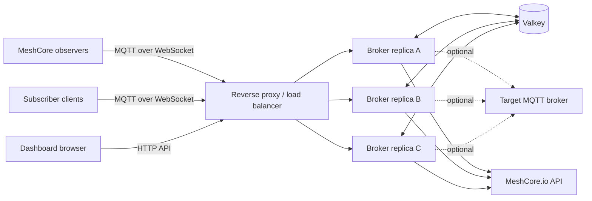
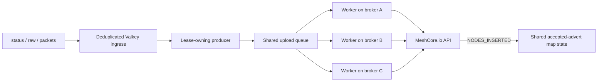

<div align="center">

# MeshCore MQTT Broker

**A cluster-ready MQTT-over-WebSocket broker built specifically for MeshCore observers.**

Public-key authentication, strict topic authorization, shared Valkey state, an operator dashboard, distributed MeshCore.io advert uploads, and optional upstream forwarding — in one deployable service.

[](https://github.com/Bjorkan/meshcore-mqtt-broker/actions/workflows/build-image-broker.yml)
[](https://github.com/Bjorkan/meshcore-mqtt-broker/actions/workflows/dashboard-screenshots.yml)
[](https://hub.docker.com/r/bjorkan/meshcore-mqtt-broker)
[](https://github.com/Bjorkan/meshcore-mqtt-broker/pkgs/container/meshcore-mqtt-broker)
[](https://nodejs.org/)
[](https://www.typescriptlang.org/)
[](LICENSE.md)

[Quick start](#quick-start) · [Dashboard](#operator-dashboard) · [Configuration](#configuration) · [Authentication](#authentication-and-authorization) · [Architecture](#architecture) · [API](#public-api)

</div>

---

## What this project provides

| Capability                   | Description                                                                                                             |
| ---------------------------- | ----------------------------------------------------------------------------------------------------------------------- |
| **MeshCore authentication**  | Verifies Ed25519-signed authentication tokens against the observer public key.                                          |
| **Strict authorization**     | Enforces MeshCore topic structure, region allowlists, publisher identity, subscriber roles, and reserved-topic rules.   |
| **Cluster operation**        | Uses Valkey for MQTT routing, persistence, observer ownership, subscriber limits, dashboard state, and abuse decisions. |
| **Operator dashboard**       | Provides responsive cluster, broker, observer, denied-event, subscriber, and MeshCore.io views.                         |
| **MeshCore.io integration**  | Coordinates advert parsing, queueing, retries, distributed workers, failover, and a map of accepted adverts.            |
| **Target forwarding**        | Optionally forwards locally owned observer traffic to another MQTT broker without retained state.                       |
| **Abuse controls**           | Detects duplicate traffic, anomalous rates, oversized packets, topic churn, and other policy violations.                |
| **Production health checks** | Verifies an authenticated MQTT publish/subscribe loopback and current Valkey readiness.                                 |

> [!IMPORTANT]
> This is an **MQTT-over-WebSocket** broker. Clients connect using `ws://` or `wss://`; the listener is not a raw MQTT/TCP endpoint.

## At a glance

| Item                    | Default                                                                   |
| ----------------------- | ------------------------------------------------------------------------- |
| MQTT WebSocket endpoint | `ws://localhost:8883`                                                     |
| Dashboard and HTTP API  | `http://localhost:8080`                                                   |
| Required state service  | Valkey using the Redis protocol                                           |
| Container images        | `bjorkan/meshcore-mqtt-broker` and `ghcr.io/bjorkan/meshcore-mqtt-broker` |
| Runtime configuration   | Read-only `config.yaml`                                                   |
| Supported runtime       | Node.js 24                                                                |

## Quick start

### 1. Create a local configuration

Start from the supplied [`config.yaml`](config.yaml) and change at least:

- `auth.expected_audience`
- all subscriber passwords
- `allowed_regions`
- `broker.name`

A minimal configuration looks like this:

```yaml
mqtt:
  ws_port: 8883
  host: 0.0.0.0
  ws_max_payload_bytes: 65536
  json_publish_max_bytes: 8192

dashboard:
  port: 8080

broker:
  kv_url: redis://valkey:6379
  kv_namespace: meshcore-mqtt-broker
  name: Broker

auth:
  expected_audience: mqtt.example.com

subscribers:
  default_max_connections: 2
  users:
    - username: dashboard-reader
      password: replace-this-password
      role: 2

allowed_regions:
  STO:
    friendly_name: Stockholm area
  GOT:
    friendly_name: Gothenburg area
```

### 2. Start the broker and Valkey

```yaml
services:
  broker:
    image: ghcr.io/bjorkan/meshcore-mqtt-broker:latest
    restart: unless-stopped
    volumes:
      - ./config.yaml:/run/configs/meshcore-mqtt-broker-config.yaml:ro
    ports:
      - "8080:8080"
      - "8883:8883"
    depends_on:
      - valkey

  valkey:
    image: valkey/valkey:9-alpine
    restart: unless-stopped
    command: ["valkey-server", "--appendonly", "yes"]
    volumes:
      - valkey-data:/data

volumes:
  valkey-data:
```

Save the file as `compose.yaml`, then run:

```bash
docker compose up -d
```

The repository also contains a smaller [`compose.yaml.example`](compose.yaml.example) that can be used as a starting point.

### 3. Verify the deployment

```bash
docker compose ps
docker compose logs -f broker
curl --fail http://localhost:8080/api/dashboard
```

Open the dashboard at `http://localhost:8080`.

> [!TIP]
> In production, terminate TLS at a reverse proxy and expose the MQTT endpoint as `wss://mqtt.example.com`. Ensure that WebSocket upgrades are forwarded correctly.

## Operator dashboard

The dashboard is a responsive React interface backed by the same shared Valkey state used by every broker replica. Any healthy instance can therefore return the same cluster view.

| View            | Purpose                                                                                                                |
| --------------- | ---------------------------------------------------------------------------------------------------------------------- |
| **Overview**    | Cluster health, active observers, publish rate, denied events, traffic distribution, and recent activity.              |
| **Brokers**     | Broker readiness, uptime, observer ownership, forwarding state, throughput, and per-instance details.                  |
| **Observers**   | Searchable observer list with region, connection state, recent messages, and policy status.                            |
| **MeshCore.io** | Producer lease, shared queue, worker state, upload results, retry history, and accepted adverts on an interactive map. |
| **Denied**      | Invalid-region publishes, enforced denials, shadow-mode warnings, reasons, expiration, and reporting broker.           |
| **Subscribers** | Active subscriber accounts, connection counts, client IDs, connected brokers, and current topic filters.               |

The interface includes desktop and mobile layouts, sortable tables, accessible modal dialogs, theme-aware styling, long-value handling, and predictable empty/error states.

### MeshCore.io advert map

The MeshCore.io view records the latest position for every advert that MeshCore.io confirms with `NODES_INSERTED`.

- Only accepted adverts are displayed.
- The most recent position replaces older positions for the same node.
- Map entries older than seven days are removed.
- Repeater, room, and sensor nodes use distinct markers.
- Map state is shared through Valkey and survives broker failover.

## Architecture



Valkey is required even for a single broker replica. It provides:

- Aedes cluster message routing and outgoing-packet persistence
- broker readiness and cluster metrics
- observer claims and reconnect takeover protection
- subscriber connection counting and topic-filter snapshots
- shared abuse and trust state
- denied-publish and recent-publish history
- MeshCore.io ingress, leader election, work queues, retries, and accepted advert positions

For a detailed component-level description, see [`ARCHITECTURE.md`](ARCHITECTURE.md).

## Authentication and authorization

The broker supports two deliberately separate client models:

1. **MeshCore publishers**, authenticated with a MeshCore public key and signed token.
2. **Configured subscribers**, authenticated with a username/password entry from `config.yaml`.

### MeshCore publisher authentication

The MQTT username must use this format:

```text
v1_{UPPERCASE_PUBLIC_KEY}
```

Example:

```text
v1_7E7662676F7F0850A8A355BAAFBFC1EB7B4174C340442D7D7161C9474A2C9400
```

The MQTT password is a JWT-style token signed by the MeshCore Ed25519 private key. The token audience must match `auth.expected_audience`.

```javascript
import { createAuthToken } from "@michaelhart/meshcore-decoder";

const publicKey =
  "7E7662676F7F0850A8A355BAAFBFC1EB7B4174C340442D7D7161C9474A2C9400";
const privateKey = "YOUR_64_BYTE_PRIVATE_KEY_HEX";

const password = await createAuthToken(
  {
    publicKey,
    aud: "mqtt.example.com",
    iat: Math.floor(Date.now() / 1000),
    exp: Math.floor(Date.now() / 1000) + 3600,
  },
  privateKey,
  publicKey,
);
```

### Subscriber roles

| Role                | Access                                                                                                         |
| ------------------- | -------------------------------------------------------------------------------------------------------------- |
| **1 — Admin**       | Public topics, broker-owned `/internal` topics, `$SYS/*`, and admin-only `/serial/commands` publishing.        |
| **2 — Full access** | Public MeshCore topics without payload filtering; no `/internal` or `$SYS/*` access.                           |
| **3 — Limited**     | Public topics with sensitive fields such as RSSI, SNR, score, statistics, model, and firmware version removed. |

Connection limits are enforced cluster-wide, not independently per replica.

> [!CAUTION]
> Role 1 can access broker-owned internal telemetry that may contain personally identifiable information. Use unique credentials and restrict administrative accounts carefully.

## MQTT topics

Publishers may publish only to topics shaped like:

```text
meshcore/{IATA_CODE}/{PUBLIC_KEY}/{subtopic}
```

Examples:

```text
meshcore/STO/7E7662676F7F0850A8A355BAAFBFC1EB7B4174C340442D7D7161C9474A2C9400/status
meshcore/STO/7E7662676F7F0850A8A355BAAFBFC1EB7B4174C340442D7D7161C9474A2C9400/packets
meshcore/STO/7E7662676F7F0850A8A355BAAFBFC1EB7B4174C340442D7D7161C9474A2C9400/raw
meshcore/STO/7E7662676F7F0850A8A355BAAFBFC1EB7B4174C340442D7D7161C9474A2C9400/serial/responses
```

Rules enforced by the broker:

- `{IATA_CODE}` must exist under `allowed_regions`, or be the special test region where supported.
- `{PUBLIC_KEY}` must be the authenticated 64-character public key.
- normal publishes must contain valid JSON with a matching `origin_id`.
- client-provided retained state is always stripped.
- `/internal` is broker-owned and cannot be published by observers.
- `/serial/commands` is restricted to role 1 subscribers.
- a publisher may subscribe only to its own exact serial-command topic.
- non-admin subscribers are blocked from reserved topics both during subscription and message forwarding.

### Node.js client example

```javascript
import mqtt from "mqtt";
import { createAuthToken } from "@michaelhart/meshcore-decoder";

const publicKey =
  "7E7662676F7F0850A8A355BAAFBFC1EB7B4174C340442D7D7161C9474A2C9400";
const privateKey = "YOUR_64_BYTE_PRIVATE_KEY_HEX";

const password = await createAuthToken(
  {
    publicKey,
    aud: "mqtt.example.com",
    iat: Math.floor(Date.now() / 1000),
    exp: Math.floor(Date.now() / 1000) + 3600,
  },
  privateKey,
  publicKey,
);

const client = mqtt.connect("wss://mqtt.example.com", {
  clientId: "meshcore-observer",
  username: `v1_${publicKey}`,
  password,
});

client.on("connect", () => {
  const topic = `meshcore/STO/${publicKey}/status`;

  client.publish(
    topic,
    JSON.stringify({
      origin_id: publicKey,
      name: "Rooftop observer",
    }),
    { retain: false },
  );
});
```

## Configuration

The broker reads `config.yaml` at startup and never writes to it. This makes the file suitable for read-only bind mounts, Docker configs, Kubernetes ConfigMaps, or equivalent secret/config systems.

The following paths are checked automatically:

1. `./config.yaml`
2. `./broker/config.yaml`
3. `/run/configs/meshcore-mqtt-broker-config.yaml`
4. `/run/configs/config.yaml`

### Configuration sections

| Section           | Controls                                                                            |
| ----------------- | ----------------------------------------------------------------------------------- |
| `mqtt`            | Listener address, WebSocket port, transport payload limit, and JSON payload limit.  |
| `dashboard`       | Dashboard/API HTTP port.                                                            |
| `broker`          | Valkey URL, namespace, broker name, and shared-cache behavior.                      |
| `auth`            | Required token audience.                                                            |
| `subscribers`     | Subscriber credentials, roles, and connection limits.                               |
| `allowed_regions` | Accepted IATA region codes and operator-friendly names.                             |
| `proxy`           | Trusted proxy handling and CIDR allowlist.                                          |
| `target_mqtt`     | Optional forwarding target, credentials, TLS policy, and reconnect timing.          |
| `meshcore_io`     | Advert upload pipeline, worker counts, retries, queue limits, and failover timings. |
| `abuse`           | Detection thresholds and enforcement mode.                                          |
| `healthcheck`     | MQTT and Valkey probe timeouts and readiness freshness.                             |

All numeric settings are validated before the broker starts listening. Invalid ports, payload limits, counters, time windows, or connection limits fail startup instead of silently falling back.

See the fully documented [`config.yaml`](config.yaml) for every available option.

## Distributed MeshCore.io uploads

The integrated MeshCore.io pipeline replaces the need for a separate MQTT-to-MeshCore.io process.



Enable it explicitly:

```yaml
meshcore_io:
  enabled: true
  api_url: https://map.meshcore.io/api/v1/uploader/node
  dry_run: false
  min_reupload_seconds: 3600
  workers_per_broker: 1
  max_queued_uploads: 250
```

Exactly one broker holds the renewable producer lease. Every healthy broker may run upload workers. When a producer or worker disappears, another replica can reclaim its unfinished work after the configured timeout.

Use `dry_run: true` to exercise parsing, verification, leader election, queueing, retries, and dashboard reporting without sending requests to MeshCore.io.

## Target broker forwarding

Locally owned observer traffic can be forwarded to another MQTT broker:

```yaml
target_mqtt:
  url: mqtts://mqtt.example.net:8883
  username: bridge-user
  password: replace-this-password
  reject_unauthorized: true
```

Forwarding behavior:

- disabled when `target_mqtt.url` is empty
- performed only by the replica that currently owns the observer claim
- preserves the original topic and payload
- always publishes with `retain: false`
- uses a distinct client ID for every broker runtime

## Abuse detection

The broker can evaluate:

- repeated or highly duplicated payloads
- packet rates and token-bucket exhaustion
- excessive packet size or packet-copy counts
- unusual topic churn
- IATA change observations
- invalid or unlisted region codes

Two operation modes are available:

| Mode                         | Behavior                                                       |
| ---------------------------- | -------------------------------------------------------------- |
| `enforcement_enabled: false` | Records a `would_mute` warning and allows traffic to continue. |
| `enforcement_enabled: true`  | Rejects traffic while the time-limited denial is active.       |

The first enforced denial lasts one hour. Subsequent enforced denials for the same public key last six hours. Trust state is shared across broker replicas through Valkey.

Invalid or unlisted IATA publishes are denied immediately, but are not automatically treated as an abuse ban.

## Deployment

### Docker Compose

Use the [quick-start Compose file](#2-start-the-broker-and-valkey) for a single-node installation.

### Docker Swarm

```yaml
services:
  broker:
    image: ghcr.io/bjorkan/meshcore-mqtt-broker:latest
    networks:
      - backend
    configs:
      - source: broker_config
        target: /run/configs/meshcore-mqtt-broker-config.yaml
    deploy:
      replicas: 3
      update_config:
        order: start-first

  valkey:
    image: valkey/valkey:9-alpine
    command: ["valkey-server", "--appendonly", "yes"]
    networks:
      - backend
    volumes:
      - valkey-data:/data

networks:
  backend:
    driver: overlay

volumes:
  valkey-data:

configs:
  broker_config:
    file: ./config.yaml
```

Place a WebSocket-capable reverse proxy or load balancer in front of the broker replicas. All replicas must use the same `broker.kv_url` and `broker.kv_namespace`.

### Container health check

The image health check performs more than an HTTP request. It:

1. reads runtime-generated `docker_health` credentials,
2. connects to the local MQTT WebSocket listener,
3. subscribes to `healthcheck/docker_health`,
4. publishes a unique payload to the same topic,
5. verifies that exact payload returns through the broker, and
6. confirms that the current broker readiness record in Valkey is fresh.

A container is marked healthy only when both MQTT delivery and Valkey-backed cluster readiness work.

## Public API

### Observer status

```http
GET /api/v1/observers/{publicKey}/status
```

This read-only endpoint does not require an API key.

| HTTP status | API status | Meaning                                                                     |
| ----------- | ---------- | --------------------------------------------------------------------------- |
| `200`       | `known`    | The observer is currently known to the cluster.                             |
| `200`       | `blocked`  | A denial or blocked trust state exists; this takes precedence over `known`. |
| `200`       | `unknown`  | No matching observer or blocked state was found.                            |
| `400`       | `invalid`  | The public key is not valid 64-character hexadecimal input.                 |
| `500`       | `error`    | An unexpected server-side lookup failure occurred.                          |

Example:

```bash
curl --silent \
  http://localhost:8080/api/v1/observers/7E7662676F7F0850A8A355BAAFBFC1EB7B4174C340442D7D7161C9474A2C9400/status
```

```json
{
  "status": "known",
  "publicKey": "7E7662676F7F0850A8A355BAAFBFC1EB7B4174C340442D7D7161C9474A2C9400",
  "observer": {
    "publicKey": "7E7662676F7F0850A8A355BAAFBFC1EB7B4174C340442D7D7161C9474A2C9400",
    "shortKey": "7E7662676F...2C9400",
    "region": "STO",
    "name": "Rooftop observer",
    "brokerId": "Broker-42GH",
    "lastSeen": 1783590000000
  }
}
```

Fields such as `region`, `name`, `brokerId`, `lastSeen`, `deniedUntilText`, and `mutedUntil` may be absent or `null`.

For implementation conventions and endpoint-development guidance, see [`API_DEVELOPMENT.md`](API_DEVELOPMENT.md).

## Operator CLI

The container includes `mc-mqtt`, which talks directly to Valkey using the configured namespace.

```bash
mc-mqtt status
mc-mqtt observer list
mc-mqtt abuse list
mc-mqtt abuse remove <PUBLIC_KEY>
mc-mqtt abuse clearall
mc-mqtt reset
```

`reset` clears the entire broker namespace and requires explicit confirmation.

## Development

### Requirements

- Node.js 24
- npm
- a reachable Valkey instance for integration tests
- Chromium when capturing dashboard screenshots

### Common commands

```bash
npm ci
npm run dev
npm run check
npm test
```

| Command                         | Purpose                                                                                  |
| ------------------------------- | ---------------------------------------------------------------------------------------- |
| `npm run dev`                   | Run the TypeScript server directly with `ts-node`.                                       |
| `npm run build`                 | Compile server code and bundle the dashboard.                                            |
| `npm run check`                 | Validate lockfile portability, formatting, ESLint, TypeScript, and the production build. |
| `npm test`                      | Build and run the Jest test suite.                                                       |
| `npm run test:ci`               | Run the verbose CI test suite with open-handle detection.                                |
| `npm run dashboard:seed-demo`   | Seed Valkey with deterministic dashboard review data.                                    |
| `npm run dashboard:screenshots` | Capture desktop and mobile dashboard screenshots with Playwright.                        |

### Project documentation

- [`ARCHITECTURE.md`](ARCHITECTURE.md) — runtime components, data flow, state ownership, and security boundaries
- [`API_DEVELOPMENT.md`](API_DEVELOPMENT.md) — HTTP API implementation and testing conventions
- [`config.yaml`](config.yaml) — complete runtime configuration reference
- [`AGENTS.md`](AGENTS.md) — repository-specific contributor and automation guidance

## CI and releases

Pull requests run:

- lockfile portability validation
- deterministic dependency installation
- formatting and ESLint checks
- TypeScript/dashboard builds
- Jest tests against Valkey
- dashboard screenshot capture and visual-integrity checks
- container image construction and vulnerability scanning

Pushes to `main` publish `latest` and `sha-<short-sha>` tags to Docker Hub and GitHub Container Registry after all required jobs pass.

## Security notes

- Keep `config.yaml` read-only inside the container.
- Store subscriber passwords in a secrets-management system where possible.
- Do not configure the runtime-generated `docker_health` user manually.
- Restrict role 1 accounts because `/internal` may contain sensitive telemetry.
- Set `proxy.trust_proxy` only when requests arrive through explicitly trusted proxy CIDRs.
- Keep `target_mqtt.reject_unauthorized: true` unless a controlled development environment requires otherwise.
- Use `meshcore_io.dry_run: true` before enabling production advert uploads.

Security-sensitive deployment details are expanded in [`ARCHITECTURE.md`](ARCHITECTURE.md#7-security-considerations).

## License

Released under the [MIT License](LICENSE.md).

---

<div align="center">

Built for reliable MeshCore MQTT ingestion, shared cluster operation, and practical day-to-day observability.

</div>
